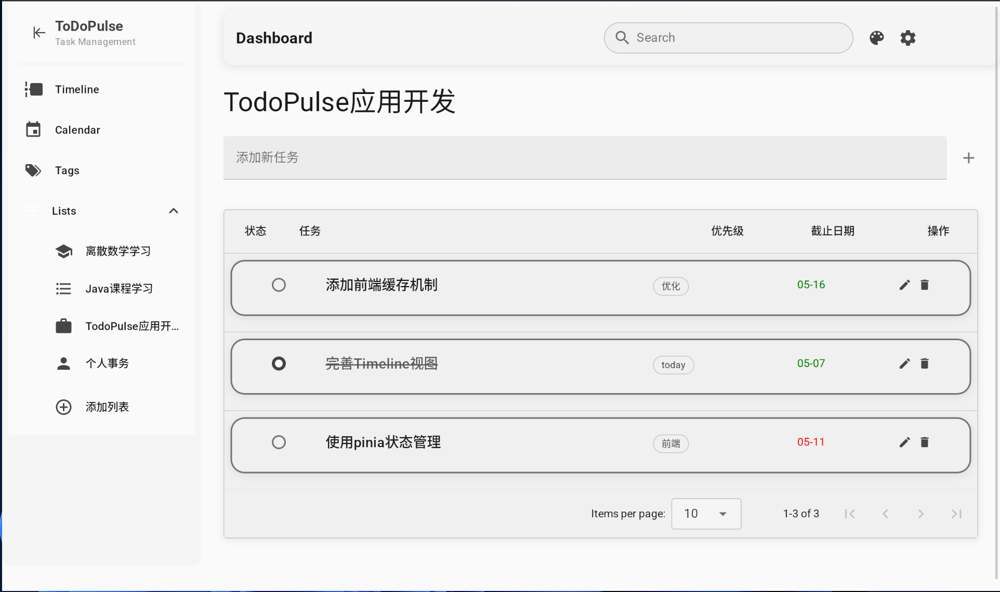
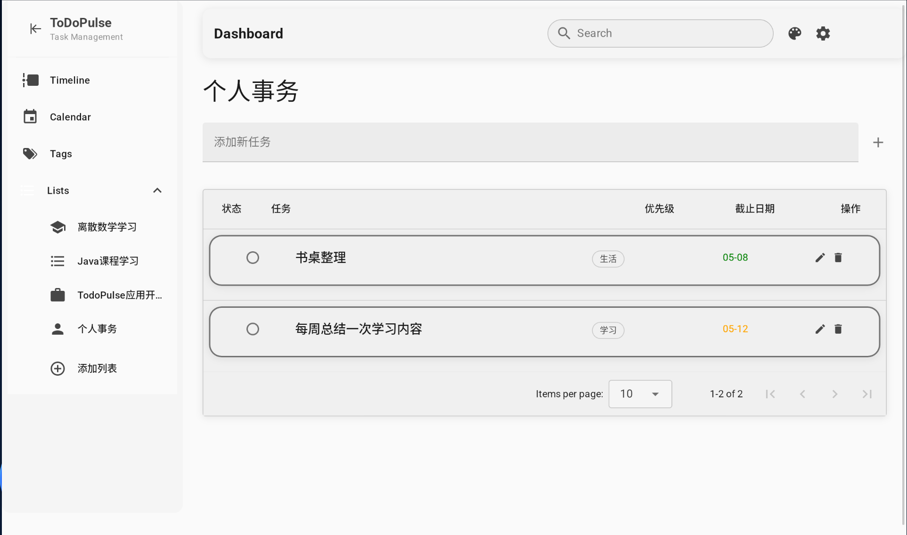
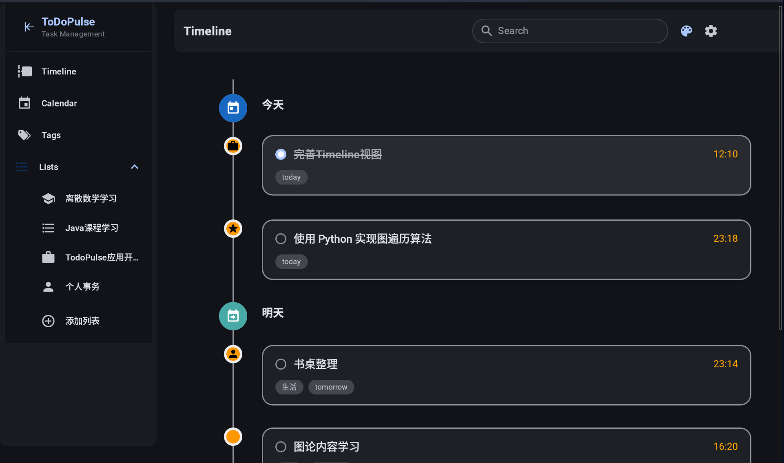
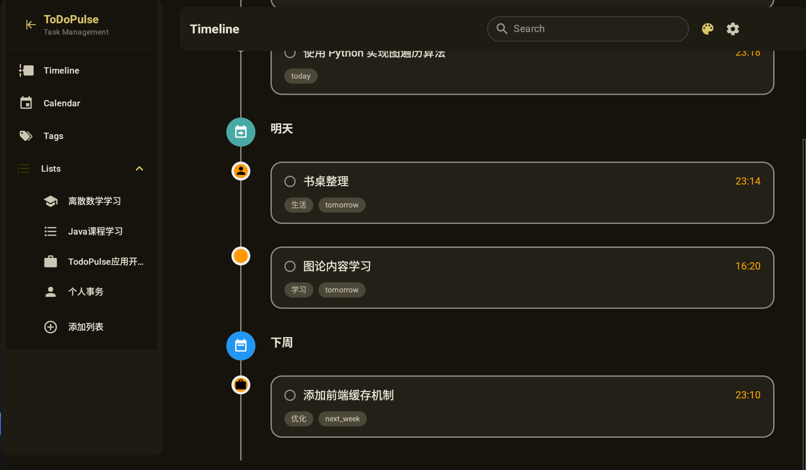
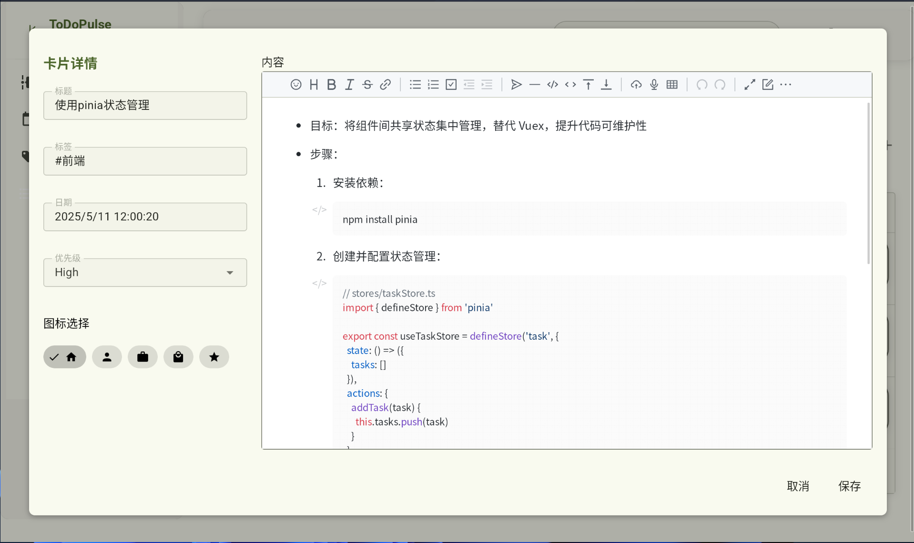
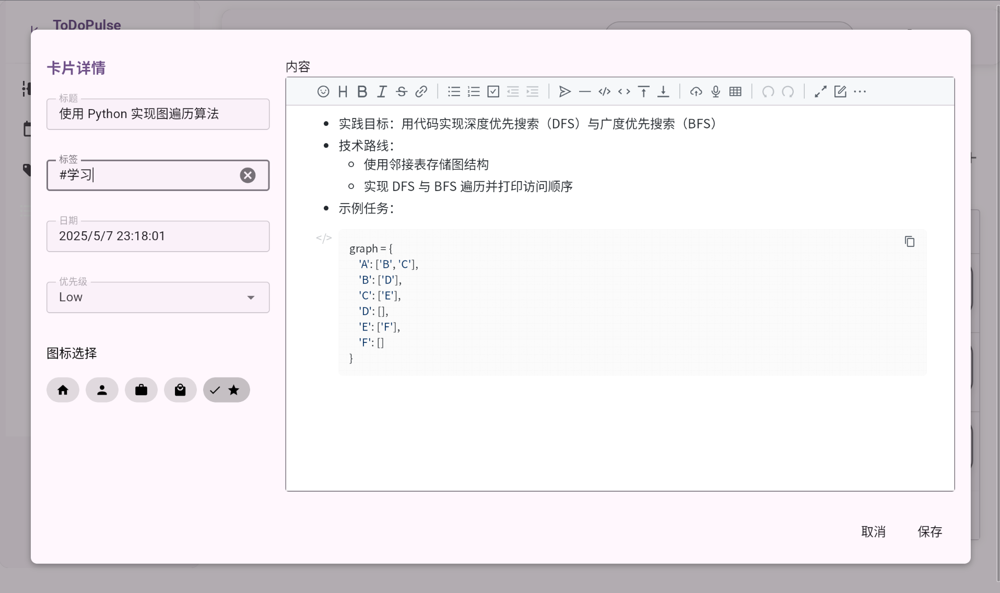
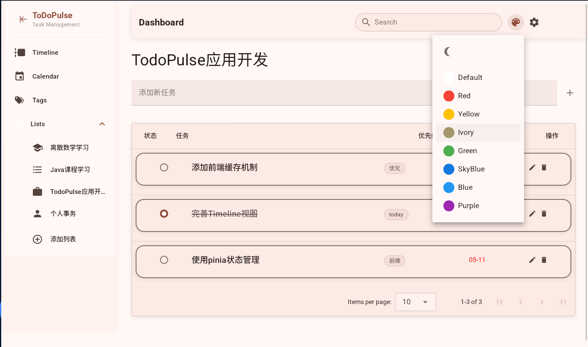
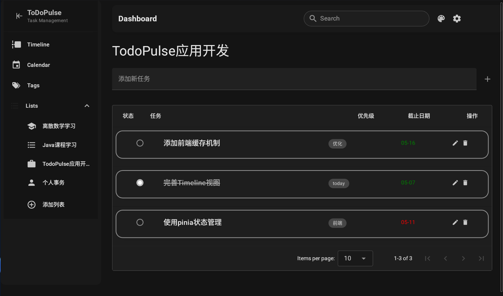
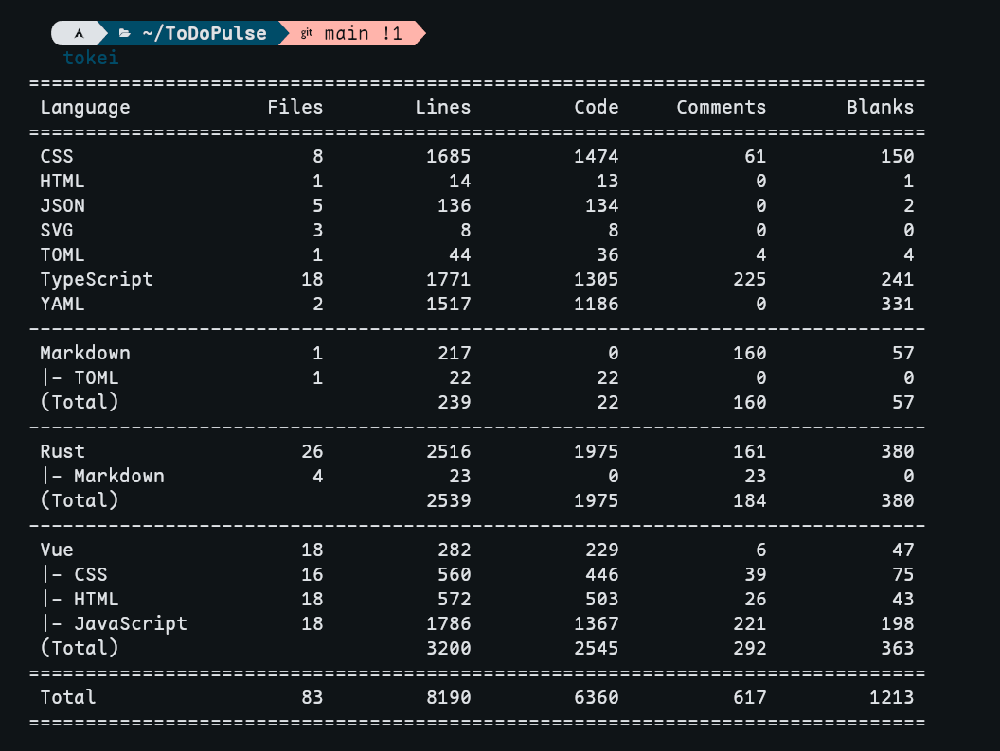

# ToDoPulse 项目文档

## 1. 项目概述

ToDoPulse - 帮助当代大学生管理自己的日程，从此告别拖沓和遗忘。

我们有多种任务视图，支持灵活切换不同视图模式以满足个人偏好；原生支持ddl提醒功能，帮助你准时完成作业；内置的md支持和检索一同允许有需求的你可以把它自行拓展成知识库管理软件；还支持用最简单的方式切换主题。

如果用两个词来概括这次项目的目标，我的回答是：简洁、丰富。

所谓简洁，指的是最大化简化日程安排本身的复杂度，让todo专注于有待完成的事件而非终日折腾todo应用。我们用ai为日程打上标签，区分其重要性和紧迫程度，从而减少自定义**重要的事情**的烦恼。同时，我们采用了同时兼容安卓，ios, macos, linux, windows的tauri作为技术框架，保证了在不同设备上使用的一致性。这也可以说是一种*简洁*吧。

所谓丰富，指的则是提供足够的自定义选项，让项目同时具有一定的可玩性。你可以使用ai生成标签，也可以手动管理；可以把它当成一个简单的todo应用，也可以把它折腾成一个类似与obsidian的笔记软件。我们对每条todo项的存储都采用一个文件，这允许你写出任意多（不超过文件系统支持的上限）的文字，记录刹那间的所思所想。  

就我们而言，这是一次尝试。因为就我们所知，中学生到大学生活过渡的一大困难就是缺乏正确的日程规划。习惯了一成不变的高中生活，就需要学会适应需要自己掌控的大学生活。更快地学会、更快地适应，相信我们的大学生活会遇见不一样的精彩，更有活力也更有温度。

## 2. 技术栈

框架

- tauri 2.x

前端

- Vue 3 框架
- 组件库：Material Design Icons
- 日历组件：FullCalendar

后端

- Rust 

## 3. 工作情况

### 3.1 作品目标

ToDoPulse 项目致力于实现以下核心目标：

1. **高效任务管理与灵活视图**：打造既简洁高效又功能全面的任务管理系统，融合时间线、看板、列表与日历等多维视图，实现事件的智能化管理与人性化操作。内置笔记功能与图片支持，确保每个任务的完整记录与追踪。

2. **无缝跨平台体验与云端同步**：基于 Tauri 技术构建统一用户体验，在桌面与移动端间实现流畅切换。通过标准化的 WebDAV 协议提供安全高效的数据同步，支持主流日历服务(如 Google Calendar)的无缝集成与导入导出。

3. **智能知识管理与内容分析**：依托 AI 技术提供事件总结与完成建议，自动构建并可视化知识间的关联网络，为复杂信息生成精准摘要，将零散信息转化为结构化知识体系。

4. **个性化时间规划与智能优先级**：基于用户行为模式与习惯分析，智能推荐最佳任务执行时间与资源分配。应用自然语言处理技术自动识别任务性质与紧急程度，根据历史完成情况动态调整任务优先级，最大化时间利用效率。


### 3.2 当前进度

| 功能模块 | 完成度 | 状态 |
|---------|-------|------|
| 基础界面框架 | 80% | 进行中 |
| 待办事项管理 | 70% | 进行中 |
| 日程安排 | 60% | 进行中 |
| 知识库管理 | 50% | 进行中 |
| AI agent开发 | 30% | 初步开发 |
| AI助手集成 | 30% | 初步开发 |
| 数据存储与同步 | 40% | 开发中 |
| 跨平台适配 | 60% | 进行中 |
| 主题切换 | 100% | 完成 |


整体项目完成度：**60%**

### 3.3 里程碑

- [x] 项目初始化与技术选型
- [x] 基础UI框架完成
- [x] 核心功能实现
- [ ] 日常管理功能
- [ ] AI助手功能集成
- [ ] 跨平台同步功能

### 3.4 人员分工

| 角色 | 负责人 | 工作内容 |
|------|-------|---------|
| 项目负责人 | | |
| 前端开发 | | |
| 后端开发 | | |
| UI/UX设计 | | |
| AI功能开发 | | |
| 测试 | | |

## 4.项目结构

```plaintext
ToDoPulse/
├── src/                  # 前端源码
│   ├── assets/           # 静态资源文件
│   │   ├── images/       # 图片资源
│   │   └── fonts/        # 字体资源
│   ├── components/       # Vue组件
│   │   ├── Cards/        # 卡片相关组件
│   │   ├── Lists/        # 列表相关组件
│   │   ├── Modals/       # 模态框组件
│   │   └── Views/        # 视图组件
│   ├── router/           # 路由配置
│   ├── store/            # 状态管理
│   ├── services/         # 前端服务
│   │   ├── CardDataService.js    # 卡片数据服务
│   │   ├── ListDataService.js    # 列表数据服务
│   │   └── KnowledgeBaseService.js # 知识库服务
│   ├── utils/            # 工具函数
│   ├── styles/           # 样式文件
│   ├── App.vue           # 应用主组件
│   ├── main.js           # 应用入口
│   └── index.html        # HTML模板
├── src-tauri/            # Tauri/Rust后端
│   ├── src/              # Rust源代码
│   │   ├── lib.rs        # 主库文件
│   │   ├── main.rs       # 应用入口点
│   │   ├── dirs.rs       # 目录相关功能
│   │   ├── ipc.rs        # 前后端通信
│   │   ├── storage.rs    # 数据存储
│   │   ├── aigc.rs       # AI生成内容相关
│   │   └── config.rs     # 配置管理
│   ├── Cargo.toml        # Rust依赖配置
│   ├── tauri.conf.json   # Tauri配置文件
│   └── build.rs          # 构建脚本
├── public/               # 公共静态资源
├── tests/                # 测试文件目录
├── .gitignore           # Git忽略文件
├── package.json         # 前端依赖配置
├── vite.config.js       # Vite配置
└── README.md            # 项目文档
```

## 5. 配置文件

配置采用toml文件。以下是一个配置文件示例。
```toml
[Info]
[Info.table]
switch = false
time = [
  "12:00",
  "13:00",
]
[Info,email]
switch = false
time = [
  "12:00",
  "13:00",
]
[Interface]
dark = false
compact = false
[Personal]
lang = "zh-CN"
[Model]
switch = false
name = "deepseek-v3"
tokens = " "
```

## 6.开发与构建指南

开发环境设置
1. 安装依赖

``` bash
pnpm install
```

2. 启动开发服务器

``` bash
pnpm run dev
```

3. 启动 Tauri 后端

``` bash
pnpm run tauri dev
```

4. 打包应用

``` bash
pnpm run tauri build
```

## 7. 项目截图

### 7.1 任务列表视图



### 7.2 时间线视图



### 7.3 内容展示



### 7.4 主题设置



## 8. 未来计划

### 8.1 近期计划
- 完善AI助手功能，提升智能建议的准确性
  - 集成多种大语言模型API，提供更智能的任务规划建议
  - 开发情感识别功能，根据用户输入内容提供情感支持
  - 引入任务优先级自动推荐系统
- 优化用户界面，提升用户体验
  - 实现可自定义的工作区布局
  - 设计全新的任务卡片视觉效果
  - 优化移动端响应式设计
- 增强数据存储与同步功能
  - 实现端到端加密的云端同步
  - 添加自动备份与恢复功能
  - 优化本地存储性能

### 8.2 中期计划
- 拓展社交功能
  - 实现团队协作空间，支持多用户共享任务列表
  - 开发任务委派与进度跟踪功能
  - 添加基于关系的提醒功能（如家人生日、朋友纪念日等）
- 增强知识库功能
  - 开发知识图谱可视化工具
  - 实现智能笔记组织与关联推荐
  - 支持多媒体内容的存储与展示
- 跨平台优化
  - 完成iOS 与 Android原生应用开发
  - 针对不同设备尺寸优化用户体验
  - 实现设备间无缝切换体验


## 9. 项目地址

https://github.com/Aromatic05/ToDoPulse

## 10. 工作量证明


