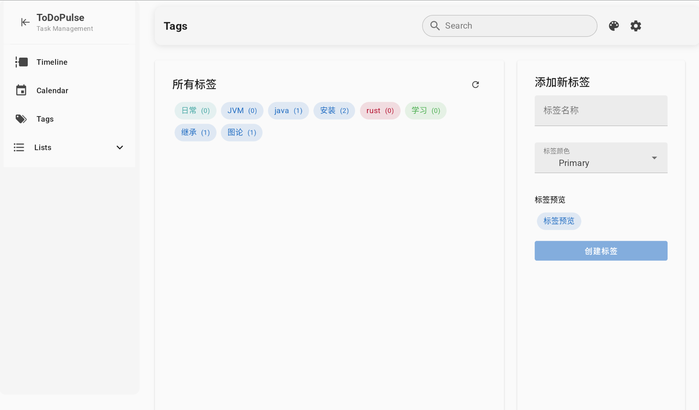
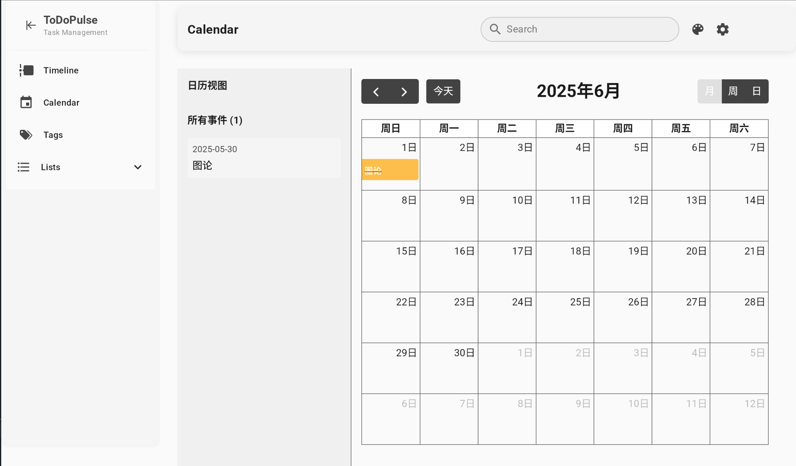
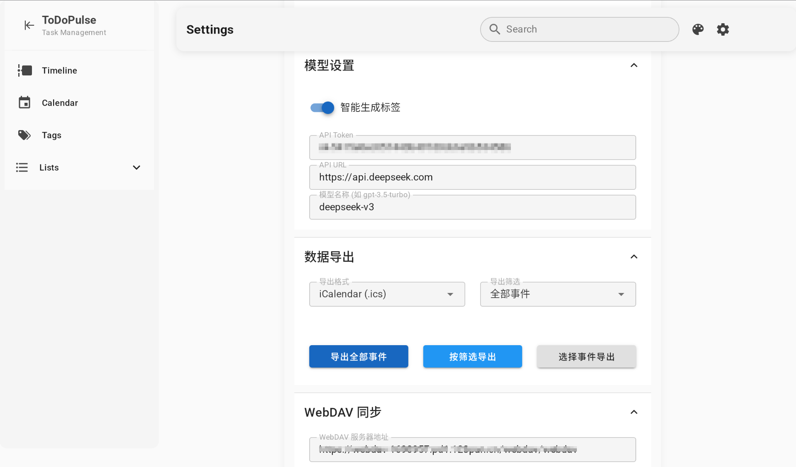
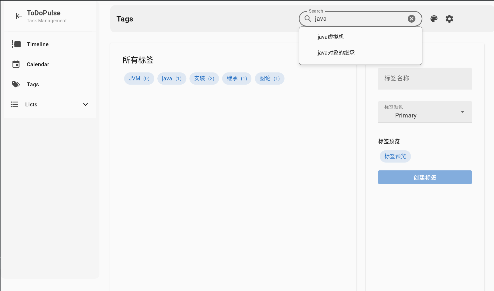
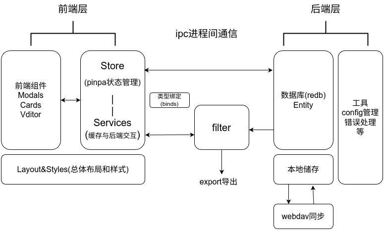

# ToDoPulse 项目文档

## 1. 项目说明

### 1.1 项目名称

  **ToDoPulse** 

 项目地址 [ToDoPulse](https://github.com/Aromatic05/ToDoPulse)

## 1.2 项目简介

ToDoPulse - 帮助当代大学生管理自己的日程，从此告别拖沓和遗忘。

我们有多种任务视图，支持灵活切换不同视图模式以满足个人偏好；原生支持ddl提醒功能，帮助你准时完成作业；内置的md支持和检索一同允许有需求的你可以把它自行拓展成知识库管理软件；还支持用最简单的方式切换主题。

如果用两个词来概括这次项目的目标，我的回答是：简洁、丰富。

所谓简洁，指的是最大化简化日程安排本身的复杂度，让todo专注于有待完成的事件而非终日折腾todo应用。我们用ai为日程打上标签，区分其重要性和紧迫程度，从而减少自定义**重要的事情**的烦恼。同时，我们采用了同时兼容android，ios, macos, linux, windows的tauri作为技术框架，保证了在不同设备上使用的一致性。这也可以说是一种*简洁*吧。

所谓丰富，指的则是提供足够的自定义选项，让项目同时具有一定的可玩性。你可以使用ai生成标签，也可以手动管理；可以把它当成一个简单的todo应用，也可以把它折腾成一个类似与obsidian的笔记软件。我们对每条todo项的存储都采用一个文件，这允许你写出任意多（不超过文件系统支持的上限）的文字，记录刹那间的所思所想。  

就我们而言，这是一次尝试。因为就我们所知，中学生到大学生活过渡的一大困难就是缺乏正确的日程规划。习惯了一成不变的高中生活，就需要学会适应需要自己掌控的大学生活。更快地学会、更快地适应，相信我们的大学生活会遇见不一样的精彩，更有活力也更有温度。

## 1.3 项目成员及分工

| 角色 | 负责人 | 工作内容 |
|------|-------|---------|
| 项目负责人 |孙一鸣 |负责进行团队沟通，协调项目进度 |
| 前端开发 |孙一鸣 |实现设计好的ui界面并提出改进 |
| 后端开发 |嵇煜人 |完成数据持久化 |
| 前后端交互 |嵇煜人 |完成ipc通信相关内容 |
| UI/UX设计 |嵇煜人和孙一鸣 |确定界面的展示形式 |
| AI功能开发 |孙一鸣 |接入了LLM的api，设计了ai工作流 |
| 测试 |孙一鸣 |测试程序bug并提醒修改 |

## 1.4 参考资料

- [Tauri 官方文档](https://tauri.app/v2/)
- [Vuefify 官方文档](https://vuetifyjs.com/zh-Hans/)
- [Google Material Design](https://m3.material.io/)
- [Vue.js 官方文档](https://cn.vuejs.org/)
- [Rust 社区文档](https://docs.rs/)
- [Vditor 官方文档](https://github.com/Vanessa219/vditor/)
- [vue-material-admin](https://github.com/armomu/vue-material-admin) - 前端页面参考项目
- [clash-nyanpasu](https://github.com/libnyanpasu/clash-nyanpasu) - Tauri 框架参考项目
- Stack Overflow 社区
- Claude AI 辅助开发

### 1.5. 技术栈

框架

- tauri 2.x

前端

- Vue 3 框架 + TypeScript服务
- 组件库：Vuefify + Material Design Icons
- 其余组件: FullCalendar, Vditor

后端

- Rust 
- 数据库 redb 
- Webdav同步 reqwest_dav

## 2. 快速开始

### 2.1 安装指南

提供了以下预编译版本：访问我们的 [GitHub Releases](https://github.com/Aromatic05/ToDoPulse/releases) 页面下载适用于不同平台的预编译版本。

```
todopulse_0.1.0_x64-setup.exe
todopulse_0.1.0_x64_en-US.msi
todopulse-0.1.0-1-x86_64.pkg.tar.zst    
todopulse_0.1.0_amd64.deb
todopulse-0.1.0-1.x86_64.rpm       
todopulse-0.1.0-arm64-release-signed.apk 
todopulse-0.1.0-arm-release-signed.apk         
todopulse-0.1.0-x86-release-signed.apk     
todopulse-0.1.0-x86_64-release-signed.apk  
```

## Windows 系统

我们为 Windows 用户提供了两种安装包：`.exe` (推荐给大多数用户) 和 `.msi` 。

### 1. 使用 `.exe` 安装包 (推荐)

1. 下载最新的 `todopulse_0.1.0_x64-setup.exe` 文件。
2. 双击下载的 `.exe` 文件以启动安装向导。
3. 按照屏幕上的指示完成安装。通常包括接受许可协议、选择安装位置（建议默认）等。

### 2. 使用 `.msi` 安装包

`.msi` 包主要用于系统管理员通过组策略等方式进行静默安装或批量部署。

1. 下载最新的 `todopulse_0.1.0_x64_en-US.msi` 文件。
2. 双击 `.msi` 文件或使用命令行进行安装。
   * **图形界面安装：** 双击文件并按照提示操作。
   * **命令行静默安装示例：**

     ```bash
     msiexec /i todopulse_0.1.0_x64_en-US.msi /qn
     ```

     (`/qn` 表示无用户界面的安静模式安装)

---

### Linux 系统

我们为 Linux 提供了多种包格式，请根据您的发行版选择。

#### 1. Debian/Ubuntu及其衍生版 (`.deb` 包)

1. 下载最新的 `todopulse_0.1.0_amd64.deb` (或对应您系统架构的版本)。
2. 打开终端，进入文件下载目录。
3. 使用 `apt` (推荐) 或 `dpkg` 进行安装：
   * **使用 `apt` (自动处理依赖):**
     ```bash
     sudo apt update
     sudo apt install ./todopulse_0.1.0_amd64.deb
     ```
   * **使用 `dpkg` (可能需要手动解决依赖):**
     ```bash
     sudo dpkg -i todopulse_0.1.0_amd64.deb
     ```

#### 2. Fedora/RHEL/CentOS/openSUSE及其衍生版 (`.rpm` 包)

1. 下载最新的 `todopulse-0.1.0-1.x86_64.rpm` (或对应您系统架构的版本)。
2. 打开终端，进入文件下载目录。
3. 使用 `dnf` (Fedora, RHEL 8+, CentOS 8+) 或 `yum` (旧版 RHEL/CentOS) 或 `zypper` (openSUSE) 进行安装：
   * **使用 `dnf`:**

     ```bash
     sudo dnf install ./todopulse-0.1.0-1.x86_64.rpm
     ```
   * **使用 `yum`:**

     ```bash
     sudo yum install ./todopulse-0.1.0-1.x86_64.rpm
     ```
   * **使用 `zypper` (openSUSE):**

     ```bash
     sudo zypper install ./todopulse-0.1.0-1.x86_64.rpm
     ```

#### 3. Arch Linux及其衍生版 (Pacman)

通常，Arch Linux 用户可以通过 AUR (Arch User Repository) 或官方/社区仓库获取软件。

* **通过直接的 Pacman 包 (`todopulse-0.1.0-1-x86_64.pkg.tar.zst`):**
  如果提供了直接的 Pacman 包：
  1. 下载 `todopulse-0.1.0-1-x86_64.pkg.tar.zst`。
  2. 安装命令：
     ```bash
     sudo pacman -U ./todopulse-0.1.0-1-x86_64.pkg.tar.zst
     ```

---

#### Android 系统

我们为 Android 提供了已签名的 `.apk` 文件，支持多种处理器架构。

1. 下载适合您设备架构的 `TodoPulse-vx.x.x-[architecture].apk` 文件

## 2.2 使用示例

### 任务列表视图


### 时间线视图


### 标签视图


### 日历视图


### 内容展示


### 主题设置


### 设置


### 搜索


## 2.3 构建指南

开发环境设置
1. 安装依赖

linux下的依赖有rustup pnpm nodejs gtk3 webkit2gtk-4.1
windows下的依赖有rustup pnpm nodejs webview2 msvc工具链(包含于visual studio2022)

``` bash
pnpm install
```

1. 启动开发服务器

``` bash
pnpm run dev
```

3. 启动 Tauri 后端

``` bash
pnpm run tauri dev
```

4. 打包应用

打包桌面版本, 生成的可执行文件位于`ToDoPulse/src-tauri/target/release/bundle/`目录下。
``` bash
pnpm run tauri build
```
打包Android版本(需要安装Android SDK和NDK), 确保ANDROID_HOME, NDK_HOME环境变量已设置, 生成的apk文件位于`ToDoPulse/src-tauri/gen/android/app/build/outputs/apk/`目录下, 需自行签名后使用. 
``` bash
pnpm tauri android init 
pnpm tauri android build --apk --split-per-abi --features mobile
```
> **注意**: 构建过程可能需要较长时间，请耐心等待。

## 3. 功能列表

### 核心功能

#### 任务管理

- **数据持久化**: 本地数据安全存储
- **分类管理**: 支持任务分类组织
- **多格式支持**: 支持 Markdown 格式和图片资源嵌入

#### 智能化功能

- **AI 标签生成**: 基于任务内容自动生成相关标签
- **智能分类**: 辅助任务组织和管理
- **AI 助手**: 提供智能任务建议和任务总结

#### 多视图模式

- **日历视图**: 基于时间的可视化任务展示
- **时间线视图**: 按时间顺序排列的任务流
- **列表视图**: 传统的列表式任务管理
- **标签视图**: 基于标签的任务分组显示

#### 数据管理

- **多格式导出**: 支持 ICS、JSON、Markdown 三种导出格式
- **云端同步**: 支持 WebDAV 协议的网盘同步
- **数据备份**: 保障数据安全性

#### 用户体验

- **托盘图标和通知系统**: 后台运行，定时提醒功能
- **个性化主题**: 支持自定义主题配置
- **跨平台一致性**: 统一的用户界面和操作体验


## 4.开发说明

### 4.1 文件概要

#### 前端架构 (src/)

```
src/
├── App.vue                 # 根组件
├── assets/                 # 静态资源
├── components/             # Vue 组件
├── layout/                 # 布局组件
├── main.ts                 # 应用入口
├── plugins/                # 插件配置
├── services/               # 服务层
├── stores/                 # 状态管理
├── styles/                 # 样式文件
└── utils/                  # 工具函数
```

#### 后端架构 (src-tauri/src/)

```
src-tauri/src/
├── entity/                 # 数据实体定义
├── error.rs                # 错误处理
├── filter/                 # 数据过滤逻辑
├── function/               # 业务逻辑函数
├── init.rs                 # 初始化模块
├── lib.rs                  # 库入口
├── main.rs                 # 应用入口
├── test/                   # 测试模块
└── utils/                  # 工具函数
```
### 4.2 模块概要



#### 前端模块

- Cards 事件卡片组件 负责展示任务的基本信息和操作按钮 (M开头的为移动端优化组件)
- Menus 右键菜单组件 负责展示任务的操作菜单
- Modals 弹窗组件 负责展示任务的详细信息和编辑界面
- Views 视图组件 负责展示不同的任务视图 (如列表、时间线、日历等) (M开头的为移动端优化组件)
- Settings 设置组件 负责展示应用的设置界面
- Services 服务层 负责与后端进行数据交互(同时负责数据缓存等任务)
- Stores 状态管理 负责管理应用的全局状态
- Layout 布局组件 负责应用的整体布局和导航(如顶部导航栏、侧边栏等) (BottomNavigation.vue为移动端优化组件)
- Styles 样式文件 负责应用的全局样式和主题配置

#### 后端模块

- entity 数据实体定义 负责定义数据模型和结构(包括List, Event, Tag等)
- error 错误处理 负责定义应用的错误类型和处理逻辑
- filter 数据过滤逻辑 负责实现数据的过滤和查询功能
- function 业务逻辑函数 负责实现具体的业务逻辑(如任务的增删改查等)
  - export  负责实现数据的导出功能
  - sync 负责实现数据的webdav同步功能
  - notify 负责实现系统通知功能
- utils 工具函数 负责实现一些通用的工具函数(如时间格式化、字符串处理等)
  - cache 负责实现数据缓存功能
  - config 负责实现应用的配置加载和保存功能
  - path 负责实现文件路径处理功能
  - time 负责实现时间相关的工具函数
  - tray 负责实现系统托盘图标和通知功能
- init 初始化模块 负责应用的初始化逻辑(如数据库连接、配置加载等)

## 5. 开发挑战与解决方案

### 性能问题

**问题描述**: 在任务列表视图中，加载大量任务时出现卡顿现象。

**解决方案**:

- 实现缓存机制，减少重复渲染
- 组件懒加载，按需加载任务数据
- 组件不即时销毁, 而是使用隐藏和显示来优化渲染性能

### 数据一致性问题

**问题描述**: 在多视图模式下，任务状态更新后未能及时同步到其他视图。

**解决方案**:

- 实现pinpa全局状态管理，确保任务状态在各视图间一致
- 使用Vue的响应式特性，确保数据变更能自动反映到视图
- 在任务状态更新时，触发全局事件通知其他组件更新

### 并发控制问题

**问题描述**: 后端多个互斥锁导致前端调用时出现死锁，程序响应停止。

**解决方案**:

- 系统性排查后端函数的锁机制
- 优化锁的获取和释放顺序
- 实施细粒度的锁控制策略

### 前后端协作问题

**问题描述**: 项目初期缺乏明确的接口规范，导致数据结构和函数签名不一致。

**解决方案**:

- 建立统一的数据接口规范
- 实现兼容性数据结构
- 建立双方代码审查机制
- 完善文档和类型定义

### 异步函数debug问题

**问题描述**: 异步函数的错误处理和调试较为复杂，导致难以定位问题。

**解决方案**:

- 使用 `Result` 和 `Option` 类型进行错误处理
- 在关键函数中添加日志输出，便于调试
- 使用 `anyhow` 库简化错误处理流程，提供更友好的错误信息
- 使用大量测试用例覆盖关键功能，确保代码的正确性
- 在开发过程中使用 `console.log` 和 `dbg!` 宏进行调试，快速定位问题

## 6. 项目不足与展望

已知bug(但不是我们的错误) [Firefox工具栏无法点击](https://bugzilla.mozilla.org/show_bug.cgi?id=1963627)
仅在Linux下出现, 由于webkit-gtk使用Firefox内核导致的, Windows下没有这个问题。

### 当前不足

1. **AI 功能响应速度**: AI 标签生成过程较慢，影响任务创建体验。
2. **用户界面设计**: 部分 UI 组件制作相对粗糙，缺乏细节打磨。
3. **AI 集成策略**: AI 功能的集成和调用频率尚未优化，可能导致成本较高。
4. **工作流智能化**: AI 辅助功能的工作流设计尚不够智能，用户体验有待提升。
5. **测试覆盖率**: 部分功能的测试覆盖率不足，可能存在未发现的潜在问题。

### 已识别的改进点

1. **AI 功能优化**
    
    - 当前问题: AI 标签生成影响任务创建速度
    - 优化方案: 实现异步处理，先创建任务，后台执行 AI 标签生成
2. **用户界面优化**
    
    - 当前状态: 部分 UI 组件制作相对粗糙
    - 改进计划: 重构关键界面组件，提升用户体验
3. **AI 集成策略**
    
    - 成本控制: 优化 API 调用频率和策略
    - 功能增强: 探索更高效的提示词工程
    - 工作流优化: 设计更智能的 AI 辅助流程

### 未来发展方向

- **功能扩展**: 增加更多智能化任务管理功能
- **性能优化**: 进一步提升应用响应速度和资源利用效率
- **用户体验**: 持续改进界面设计和交互流程
